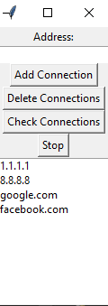
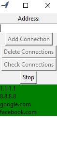
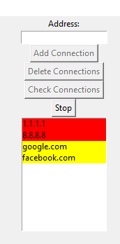

# MultiSiteChecker

This is a MulitSiteChecker were you can add, delete and check the Connectivity of IP-Adresses, FQDNs and Websites.

- *Green* Connection avaible
- *Yellow* Cannot resolve the connection
- *Red* Connection unavaible

